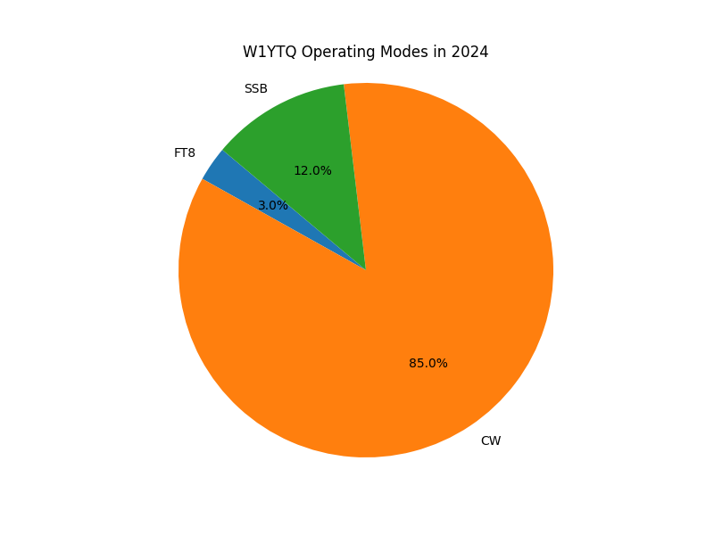

# ham-radio-utils

Personal tool developed and used by W1YTQ to filter and generate statistics from radio logging exports in adif format.

### View radio modes

        % ./process-adif.py modedist combined.adi



### Report top 10 call signs in your log

```bash
 % ./process-adif.py top10calls combined.adi
Top 10 CALL entries:
shape: (10, 2)
┌────────┬───────┐
│ CALL   ┆ count │
│ ---    ┆ ---   │
│ str    ┆ u32   │
╞════════╪═══════╡
│ AB9CA  ┆ 10    │
│ WB0RLJ ┆ 8     │
│ W4SK   ┆ 7     │
│ NS1C   ┆ 6     │
│ W8NWG  ┆ 6     │
│ W5ATJ  ┆ 5     │
│ WD5EEI ┆ 5     │
│ KS4S   ┆ 5     │
│ N2QW   ┆ 5     │
│ W9VI   ┆ 5     │
└────────┴───────┘

```

### SKCC Filter

Creates a new adi file selecting only the QSOs that have "SKCC" in the comments attribute. I use this to turn a general
QRZ adi export into an adi file containing only my SKCC contacts. I then import that filtered file into [SKCC's](https://www.skccgroup.com/)
logging software.

The command below creates a new adi file with an `skcc.adi` suffix that is a subset of the provided file. The new file
will only have SKCC QSO records which are identified because their 'comments' attribute contains the string 'skcc' or 'SKCC'.

```bash
% ./process-adif.py skcc w1ytq.349397.20250114172534.adi
% ls -alt w1ytq.349397.20250114172534*
-rw-r--r--@ 1 cfarnham  staff  14741 Jan 14 17:08 w1ytq.349397.20250114172534.skcc.adi
-rw-r--r--@ 1 cfarnham  staff  14741 Jan 14 16:56 w1ytq.349397.20250114172534.adi
```

### Display adif columns available for analysis

This is to aid in writing new features or functions by displaying the values
available for retrieval and analysis in your adi file.

```bash
    % ./process-adif.py columns w1ytq.349397.20250114172534.adi

    ['QSO_DATE', 'TIME_ON', 'CALL', 'FREQ', 'MODE', 'APP_QRZLOG_LOGID', 'APP_QRZLOG_QSLDATE',
    'APP_QRZLOG_STATUS', 'BAND', 'BAND_RX', 'CNTY', 'COMMENT', 'CONT', 'COUNTRY', 'CQZ',
    'DISTANCE', 'DXCC', 'EMAIL', 'EQSL_QSL_RCVD', 'EQSL_QSL_SENT', 'FREQ_RX', 'GRIDSQUARE',
    'ITUZ', 'LAT', 'LON', 'LOTW_QSLRDATE', 'LOTW_QSLSDATE', 'LOTW_QSL_RCVD', 'LOTW_QSL_SENT',
    'MY_CITY', 'MY_CNTY', 'MY_COUNTRY', 'MY_CQ_ZONE', 'MY_GRIDSQUARE', 'MY_ITU_ZONE', 'MY_LAT',
    'MY_LON', 'MY_NAME', 'MY_STATE', 'NAME', 'QRZCOM_QSO_DOWNLOAD_DATE',
    'QRZCOM_QSO_DOWNLOAD_STATUS', 'QRZCOM_QSO_UPLOAD_DATE', 'QRZCOM_QSO_UPLOAD_STATUS',
    'QSL_RCVD', 'QSL_SENT', 'QSL_VIA', 'QSO_DATE_OFF', 'QTH', 'STATE', 'STATION_CALLSIGN',
    'TIME_OFF', 'TX_PWR']
```

## How to install

Ensure you have Python 3 installed, preferably in a virtual environment created with a tool like `pipenv`.

Then run `pip install -r requirements.txt`

## For developers

### Manage dependencies

First update `pyproject.toml` and use `pip-tools` to generate an updated `requirements.txt`.

Only maintainers need to do this in cases where we want to manage dependencies.

Install pip-tools

    pip install pip-tools

Make sure that pyproject.toml has the libraries you want and then type:

    pip-compile


## Errata

### What's up with the `docker-compose.yml` file?

It's just a personal experiment in setting up [Wavelog](https://github.com/wavelog/wavelog) and I didn't know where else to save it. Ignore it
or if it helps you use and learn more about Wavelog then please use it.
